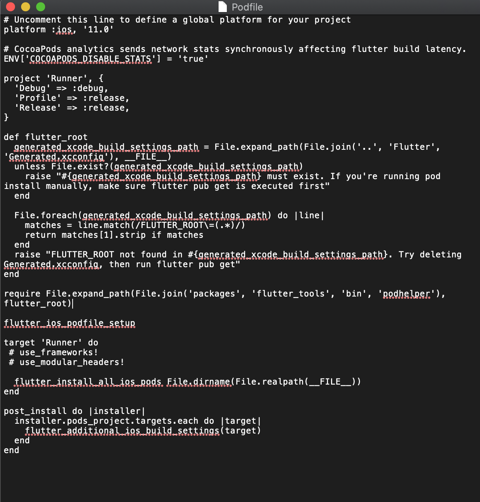

# **Compilación APP Intermediario GNP**

**Instalación de Flutter**

Descargar Flutter 1.22.2 de  
[https://flutter.dev/docs/development/tools/sdk/releases?tab=macos](https://flutter.dev/docs/development/tools/sdk/releases?tab=macos) (para Mac)  
[https://flutter.dev/docs/development/tools/sdk/releases?tab=windows](https://flutter.dev/docs/development/tools/sdk/releases?tab=windows) (para Windows)

**Compilación del proyecto**

**Android : mx.com.gnp.soysociognp  
iOS : mx.com.gnp.soysociognpapp**

**VERIFICAR QUE EL ARCHIVO main.dart QUE SE ENCUENTRA DENTRO DE LA CARPETA lib ESTE APUNTANDO AL AMBIENTE CORRECTO  
lib/main.dart**
1. Validar que dentro de la variable configuredApp este apuntando al ambiente: Ambient.pro

2. Verificar que los archivos de pro se encuentren en la carpeta
   correcta.

3. Validar que los archivos Google-Services.plist y google-services.json
   se encuentren apuntando al proyecto de producción.

# PASOS A SEGUIR PARA GENERAR APK

1.  Abrir Android Studio, abrir el proyecto.
2.  Desde la terminal de Android Studio ejecutar el comando para el ambiente:
    -  flutter build apk --release -t lib/EnvironmentVariablesSetup/main_PRO.dart --flavor pro
3. Al finalizar la ejecución del comando, en la terminal el mensaje de que termino y nos da la ruta de donde esta el archivo generado:
    ✓ Built build/app/outputs/flutter-apk/

# PASOS A SEGUIR PARA GENERAR IPA PARA iOS (solo Mac)

VALIDAR QUE SE TENGA INSTALADO XCODE VERSIÓN 11.4 A 11.7

Ejecutar los siguientes comandos:
- flutter clean
- flutter pub cache repair
- flutter pub get
- cd ios/ pod install

** Verificar que el Podfile tenga las siguientes características:**

 VALIDAR QUE AL ABRIR EL PROYECTO EN LOS ESQUEMAS SE ENCUENTRE APUNTANDO AL ESQUEMA CORRECTO: **pro**

1.  En la herramienta Xcode, abrir **Runner.xcworkspace** que se encuentra en la carpeta iOS de tu aplicación.

2. Selecciona Product > Scheme > pro.

3.  Seleccionar **Product > Destination > Generic iOS Device**

4.  Seleccionar **Runner** en el navegador de proyectos de **Xcode**, seleccionar el target **Runner** en la barra lateral de la vista de configuración.

5.  Seleccionar **Product > Archive** para generar un archivo compilado.

6.  En la barra lateral de la ventana de **Xcode Organizer**, seleccionar la aplicación **iOS**, luego seleccionar el archivo compilado que se acaba de generar.

7.  Seleccionar el botón **Distribuir App > Development**.

8.  En la ventana de opciones de distribución de desarrollo **seleccionar > All compatible device variants**.

9.  Seleccionar la opción que se requiere para firmar la app **(Automatically manage signing)**.

10.  Finalmente, seleccionar la carpeta en donde se almacenará el IPA generado.