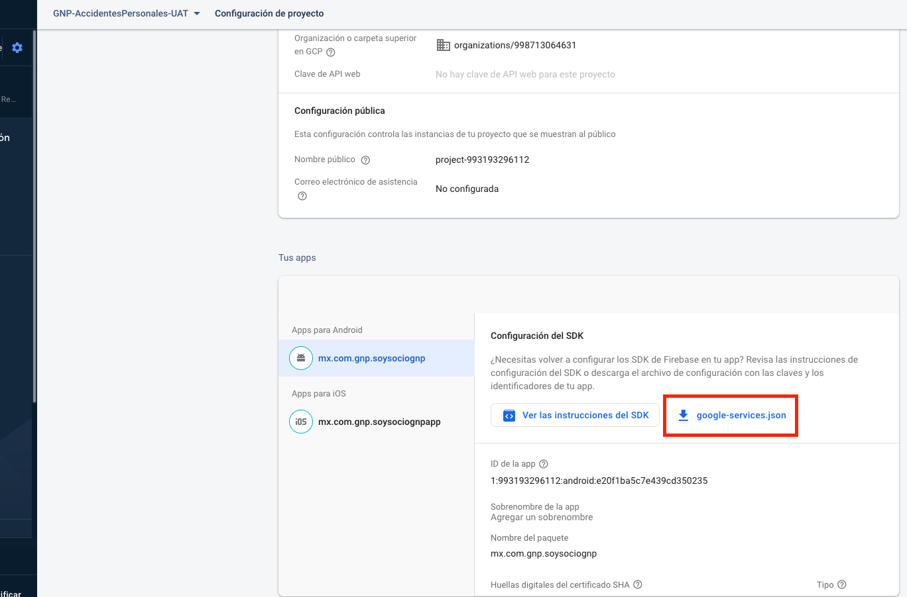
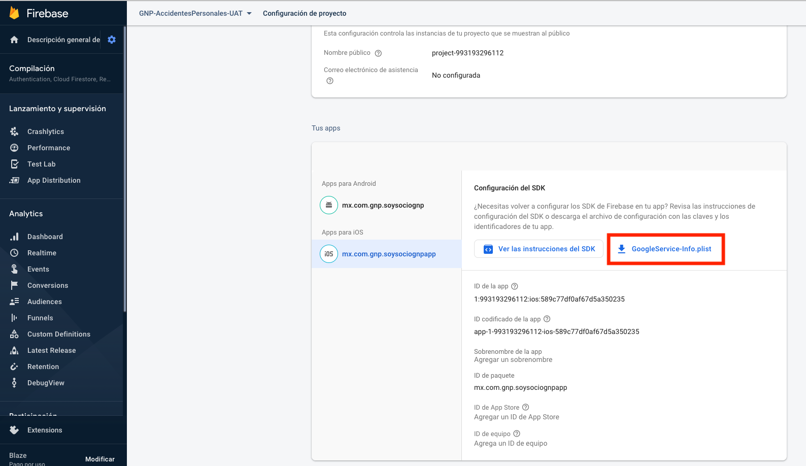

# **DESCARGA DE ARCHIVOS FIREBASE**

Solicitamos el apoyo para la descarga de los archivos de configuración
de firebase: **GNP-AccidentesPersonales-PRO** del desarrollo de
**Intermediario GNP**

1. Ir a la configuración del proyecto

2. Descargar el archivo **google-services.json** para Android

3. Descargar el archivo **GoogleService-Info.plist** para iOS

**NOTA: Enviarlos a Ismael Alvarado (ismael.alvarado@gnp.com.mx)para anexarlos al proyecto.**