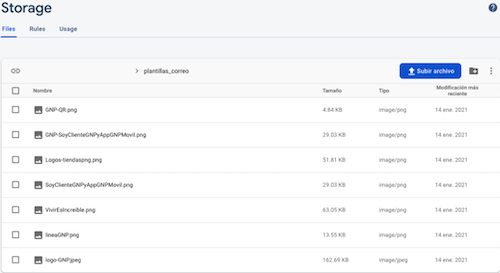
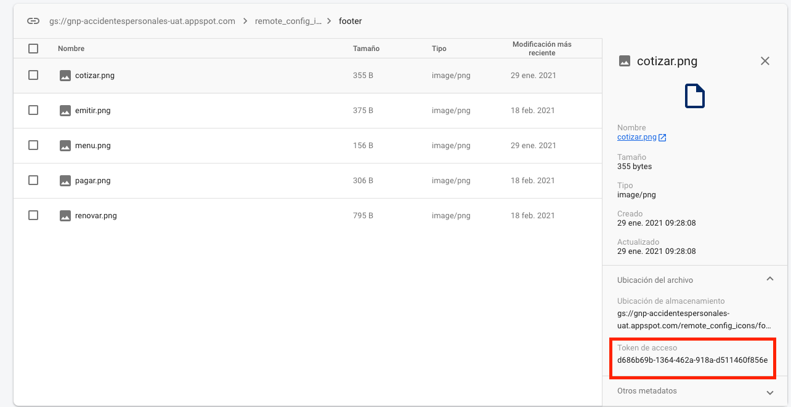
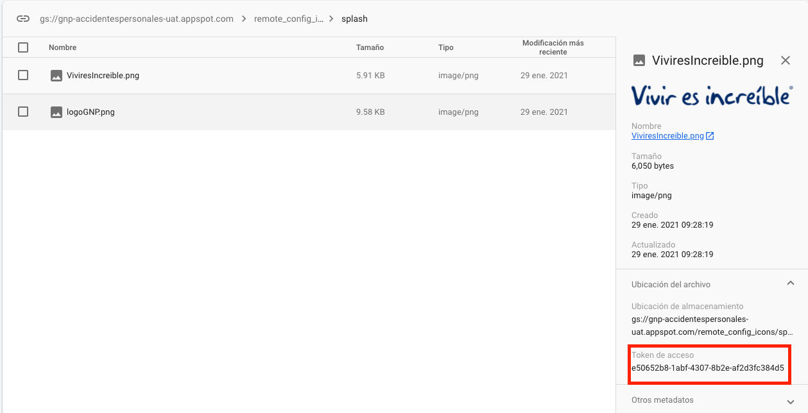
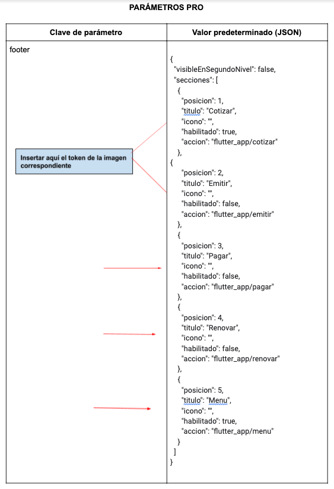
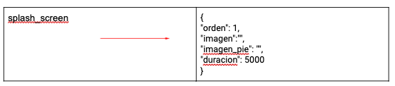

GIT:
[http://git.gnp.com.mx/EOT/COT/COT_CotizadorUnico_Flutter_App](http://git.gnp.com.mx/EOT/COT/COT_CotizadorUnico_Flutter_App)

# **CONFIGURACIÓN DE FIREBASE**

Solicitamos el apoyo para la configuración de la consola de firebase:
**GNP-AccidentesPersonales-PRO** del desarrollo de **Intermediario GNP**

Solicitamos el apoyo para obtener permisos de lectura en la consola para poder supervisar crashlytics, performance y remote config.
 
1. Almacenamiento de imágenes

- Abrir consola Firebase e ir a la sección Storage
- Modificar la carpeta con el nombre **remote_config_icons**
- Dentro de la carpeta **remote_config_icons**, en la carpeta **footer**

http://git.gnp.mx/EOT/COT/COT_CotizadorUnico_Flutter_App/-/tree/v0.0.4/cotizador_agente/doc/remote_config_icons/footer

- Agregar las imágenes que se encuentran en la carpeta de este proyecto,
  en la carpeta footer:

        cotizar.png  
        menu.png  
        emitir.png  
        pagar.png  
        renovar.png
http://git.gnp.mx/EOT/COT/COT_CotizadorUnico_Flutter_App/-/tree/v0.0.4/cotizador_agente/doc/remote_config_icons/splash

- Dentro de la carpeta **remote_config_icons** crear una carpeta con el
  nombre **splash** e integrar las imágenes que se encuentran en la
  carpeta de este proyecto splash:

        imagen.png  
        imagen_pie.png

2. Agregar JSON para Remote Config

- En la consola de Firebase, seleccionar Remote Config:
  GNP-AccidentesPersonales-PRO

**CREACIÓN DE PARÁMETROS**

- Dar clic en el botón Añadir parámetro
- En el campo Parámetro, se debe de ingresar el nombre del parámetro. Debe de ser la clave parámetro de Remote Config que se requiere en la app asociada al proyecto.
- En el campo valor predeterminado, se requiere ingresar JSON (dar clic en las llaves).
- Se desplegará una vista en donde permitirá pegar el JSON, dar clic en Formato JSON y Guardar.
- Para guardar los cambios sólo se da clic en el botón  Añadir parámetro.
- Dar clic en Publicar cambios, para que la configuración de Remote Config se quede guardada y estos datos estén disponibles para las apps asociadas al proyecto.

- Ir a la sección de Storage, donde están almacenadas las imágenes
- Abrir la carpeta con el nombre remote_config_icons
- Dentro de la carpeta remote_config_icons, se encuentra el directorio footer con las imágenes para obtener los token que se requieren como valor para la clave icono de cada imagen del json de footer, dentro de las comillas ( "" )

**NOTA: Antes de subir el JSON, agregar el Token de acceso de cada imagen correspondiente a su sección.**
- El token de acceso de cada imagen se encuentra al seleccionar dicha imagen, en el panel derecho, desplegar la opción Ubicación del archivo.

- Dentro de la carpeta remote_config_icons, se encuentra el directorio splash_screen con las imágenes para obtener los token que se requieren como valor para la clave icono de cada imagen del json de splash_screen.

**PARÁMETROS REMOTE CONFIG PRO**

http://git.gnp.mx/EOT/COT/COT_CotizadorUnico_Flutter_App/-/tree/v0.0.4/cotizador_agente/doc/parametrosJSON/footer.json

http://git.gnp.mx/EOT/COT/COT_CotizadorUnico_Flutter_App/-/tree/v0.0.4/cotizador_agente/doc/parametrosJSON/splash_screen.json

**Favor de tomar el token de acceso correspondiente a cada imagen, como
se indica en las imagenes anteriores.**

**NOTA: Se anexa el JSON base, para cada parámetro, se encuentran en la
carpeta parametrosJSON.**

**Favor que generarnos permisos para validar que se encuentren correctamente los parámetros**

