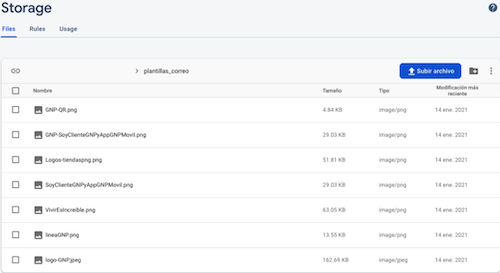
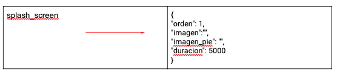
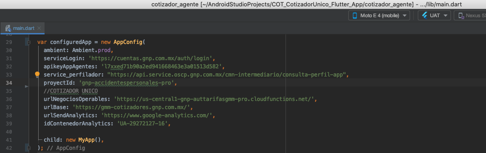
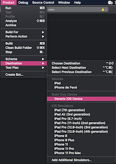

GIT:
[http://git.gnp.com.mx/EOT/COT/COT_CotizadorUnico_Flutter_App](http://git.gnp.com.mx/EOT/COT/COT_CotizadorUnico_Flutter_App)

# **CONFIGURACIÓN DE FIREBASE**

Solicitamos el apoyo para la configuración de la consola de firebase:
**GNP-AccidentesPersonales-PRO** del desarrollo de **Intermediario GNP**

1. Almacenamiento de imágenes

- Abrir consola Firebase e ir a la sección Storage
- Modificar la carpeta con el nombre **remote_config_icons**
- Dentro de la carpeta **remote_config_icons**, en la carpeta **footer**

- [remote_config_icons](remote_config_icons/footer)

- Agregar las imágenes que se encuentran en la carpeta de este proyecto,
  en la carpeta footer:

        cotizar.png  
        menu.png  
        emitir.png  
        pagar.png  
        renovar.png
- [remote_config_icons](remote_config_icons/splash)
- Dentro de la carpeta **remote_config_icons** crear una carpeta con el
  nombre **splash** e integrar las imágenes que se encuentran en la
  carpeta de este proyecto splash:

        imagen.png  
        imagen_pie.png

2. Agregar JSON para Remote Config

- En la consola de Firebase, seleccionar Remote Config:
  GNP-AccidentesPersonales-PRO

**CREACIÓN DE PARÁMETROS**

- Dar clic en el botón Añadir parámetro
- En el campo Parámetro, se debe de ingresar el nombre del parámetro. Debe de ser la clave parámetro de Remote Config que se requiere en la app asociada al proyecto.
- En el campo valor predeterminado, se requiere ingresar JSON (dar clic en las llaves).
- Se desplegará una vista en donde permitirá pegar el JSON, dar clic en Formato JSON y Guardar.
- Para guardar los cambios sólo se da clic en el botón  Añadir parámetro.
- Dar clic en Publicar cambios, para que la configuración de Remote Config se quede guardada y estos datos estén disponibles para las apps asociadas al proyecto.

- Ir a la sección de Storage, donde están almacenadas las imágenes
- Abrir la carpeta con el nombre remote_config_icons
- Dentro de la carpeta remote_config_icons, se encuentra el directorio footer con las imágenes para obtener los token que se requieren como valor para la clave icono de cada imagen del json de footer, dentro de las comillas ( "" )

**NOTA: Antes de subir el JSON, agregar el Token de acceso de cada imagen correspondiente a su sección.**
- El token de acceso de cada imagen se encuentra al seleccionar dicha imagen, en el panel derecho, desplegar la opción Ubicación del archivo.

- Dentro de la carpeta remote_config_icons, se encuentra el directorio splash_screen con las imágenes para obtener los token que se requieren como valor para la clave icono de cada imagen del json de splash_screen.

**PARÁMETROS REMOTE CONFIG PRO**

- [parametrosJSON/footer.json](parametrosJSON/footer.json)

- [parametrosJSON/splash_screen.json](parametrosJSON/splash_screen.json)

**Favor de tomar el token de acceso correspondiente a cada imagen, como
se indica en las imagenes anteriores.**

**NOTA: Se anexa el JSON base, para cada parámetro, se encuentran en la
carpeta parametrosJSON.**

# **Compilación APP Intermediario GNP**

**Instalación de Flutter**

Descargar Flutter 1.22.0 de  
[https://flutter.dev/docs/development/tools/sdk/releases?tab=macos](https://flutter.dev/docs/development/tools/sdk/releases?tab=macos) (para Mac)  
[https://flutter.dev/docs/development/tools/sdk/releases?tab=windows](https://flutter.dev/docs/development/tools/sdk/releases?tab=windows) (para Windows)

**Compilación del proyecto**

**VERIFICAR QUE EL ARCHIVO main.dart QUE SE ENCUENTRA DENTRO DE LA CARPETA lib ESTE APUNTANDO AL AMBIENTE CORRECTO  
lib/main.dart**
1. Validar que dentro de la variable configuredApp este apuntando al ambiente: Ambient.pro

2. Verificar que los archivos de pro se encuentren en la carpeta
   correcta.

3. Validar que los archivos Google-Services.plist y google-services.json
   se encuentren apuntando al proyecto de producción.

# PASOS A SEGUIR PARA GENERAR APK

1.  Abrir Android Studio, abrir el proyecto.
2.  Desde la terminal de Android Studio ejecutar el comando para el ambiente:
    -  flutter build apk --release -t lib/EnvironmentVariablesSetup/main_PRO.dart --flavor pro
3. Al finalizar la ejecución del comando, en la terminal el mensaje de que termino y nos da la ruta de donde esta el archivo generado:
    ✓ Built build/app/outputs/flutter-apk/

# PASOS A SEGUIR PARA GENERAR IPA PARA iOS (solo Mac)

VALIDAR QUE SE TENGA INSTALADO XCODE VERSIÓN 11.4 A 11.7

Ejecutar los siguientes comandos:
- flutter clean
- flutter pub cache repair
- flutter pub get
- cd ios/ pod install

** Verificar que el Podfile tenga las siguientes características:**

 VALIDAR QUE AL ABRIR EL PROYECTO EN LOS ESQUEMAS SE ENCUENTRE APUNTANDO AL ESQUEMA CORRECTO: **pro**

1.  En la herramienta Xcode, abrir **Runner.xcworkspace** que se encuentra en la carpeta iOS de tu aplicación.

2. Selecciona Product > Scheme > pro.

3.  Seleccionar **Product > Destination > Generic iOS Device**

4.  Seleccionar **Runner** en el navegador de proyectos de **Xcode**, seleccionar el target **Runner** en la barra lateral de la vista de configuración.

5.  Seleccionar **Product > Archive** para generar un archivo compilado.

6.  En la barra lateral de la ventana de **Xcode Organizer**, seleccionar la aplicación **iOS**, luego seleccionar el archivo compilado que se acaba de generar.

7.  Seleccionar el botón **Distribuir App > Development**.

8.  En la ventana de opciones de distribución de desarrollo **seleccionar > All compatible device variants**.

9.  Seleccionar la opción que se requiere para firmar la app **(Automatically manage signing)**.

10.  Finalmente, seleccionar la carpeta en donde se almacenará el IPA generado.