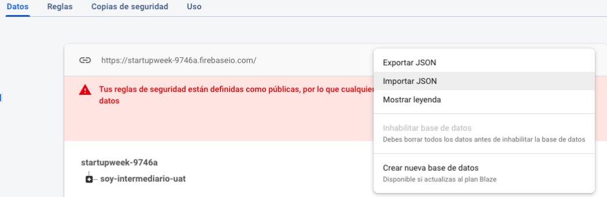
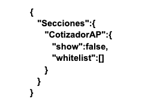
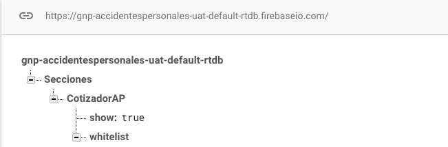

Se solicita habilitar la **Realtime Database**

Para la consola de: **GNP-AccidentesPersonales-PRO**

Para poder importar los archivos en formato .json
- En la pestaña Datos, ir al punto de menu que se encuentra a la derecha de la pantalla
- Elegir la opción Importar JSON, para seleccionar el archivo, y dar clic en Importar.

Nota: para la consola de **GNP-AccidentesPersonales-PRO** copiar el siguiente json.

{
   "Secciones":{
      "CotizadorAP":{
         "show":false,
         "whitelist":[]
      }
   }
}

El archivo compartido tendrán la siguiente información:

Teniendo en cuenta que la estructura final es la siguiente para pro:

